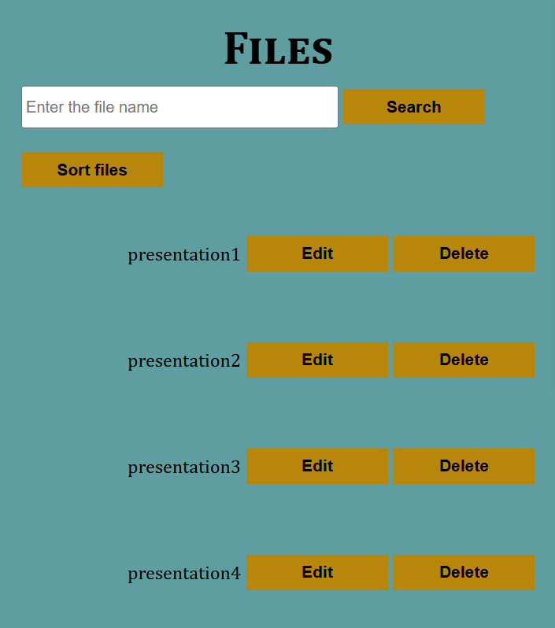
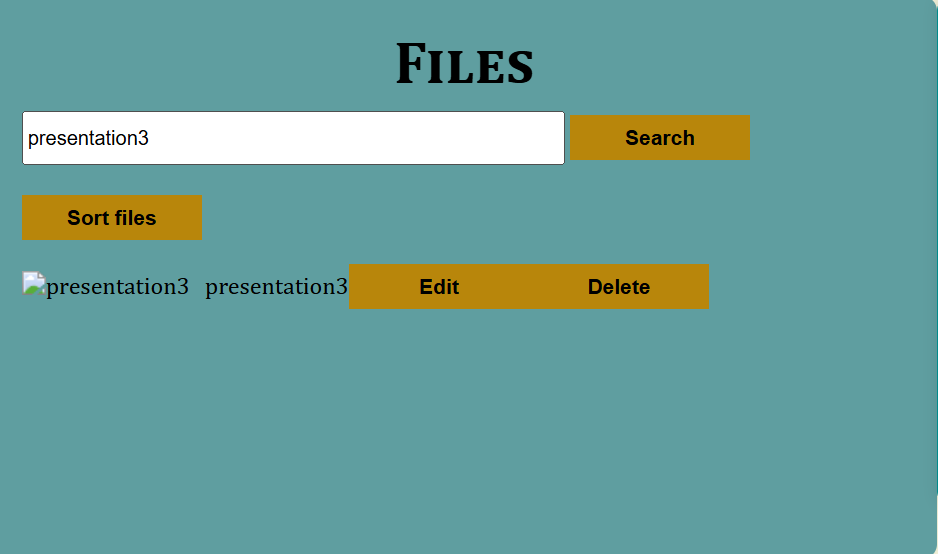
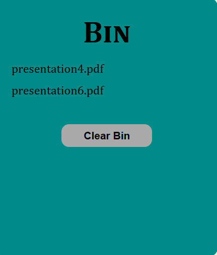

# 📂 File Organizer System (Frontend Project)

A simple **File Organizer System UI** built using **HTML, CSS, and JavaScript**.  
This project simulates a basic file management interface where files are automatically categorized based on their extensions and displayed in folders.

Users can browse files, edit file names, delete files to a bin, search files, and clear the bin.  
The project demonstrates **DOM manipulation, local storage usage, and interactive UI behavior using vanilla JavaScript.**

---

# 🚀 Features

### 📁 File Categorization
- Files are automatically grouped based on file extensions
- Folder view displays file categories like:
  - TXT
  - PDF
  - MP3
  - EXE
  - RAR
  - DOCX
  - JPG
  - PNG
  - GIF
  - ZIP

---

### 📄 File Display
- Clicking a folder shows all files belonging to that category
- Each file displays:
  - File icon
  - File name
  - Edit button
  - Delete button

---

### ✏️ File Editing
- Users can rename files
- File edit history is stored using **localStorage**

---

### 🗑️ Delete & Bin System
- Deleted files are moved to **Bin**
- Confirmation modal appears before deleting
- Files can be permanently removed by clearing the bin

---

### 🔍 File Search
- Search files by file name
- Real-time filtering of displayed files

---

### 📜 File History Tracking
- All edit and delete actions are stored
- History is saved using **browser localStorage**

---

# 🛠️ Tech Stack

## Frontend
- HTML5
- CSS3
- JavaScript (Vanilla JS)

## Concepts Used
- DOM Manipulation
- Event Handling
- Local Storage
- Dynamic UI Rendering
- Array Manipulation
- File Categorization Logic

---

# 📂 Project Structure

# 📂 Project Structure

```
file-organizer-system/
│
├── index.html
├── styles.css
├── script.js
│
└── README.md
```


---

# ⚙️ Installation & Setup

### 1️⃣ Clone the repository
git clone https://github.com/your-username/file-organizer-system.git
cd File_Management_System 

---
### 2️⃣ Run the project
Simply open: index.html
in your browser.
No server setup is required since this is a **pure frontend project**.

---

# 📸 Application Screenshots

## 📁 Folder Categories


---

## 📄 Files Section



---

## 🔍 Search Files Feature



---

## 🗑️ Bin Section



---

## ⚠️ Delete Confirmation Modal


# 📸 Application UI

The interface includes three main sections:

### 📁 Folders Panel
Displays categorized folders based on file extensions.

### 📄 Files Panel
Displays files with options to:
- Edit file name
- Delete file
- Search files
- Sort files

### 🗑️ Bin Section
Stores deleted files until cleared.

---

# 📈 Future Improvements

- Drag & drop file management
- File upload system
- Folder creation feature
- Cloud storage integration
- Backend file database
- File preview functionality
